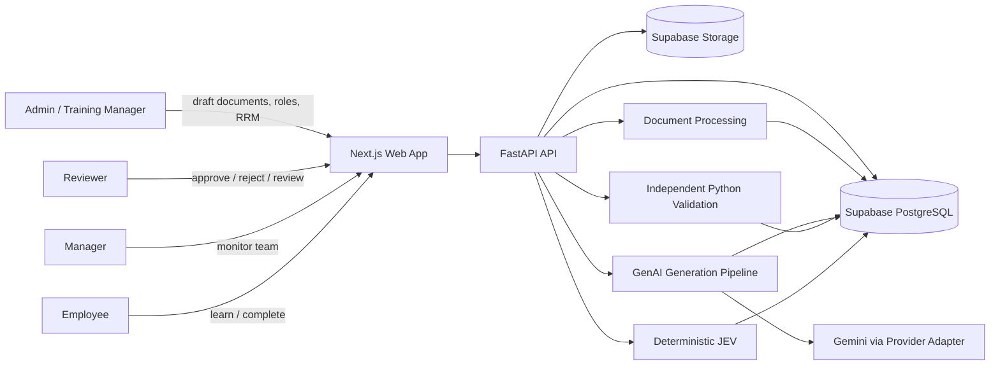
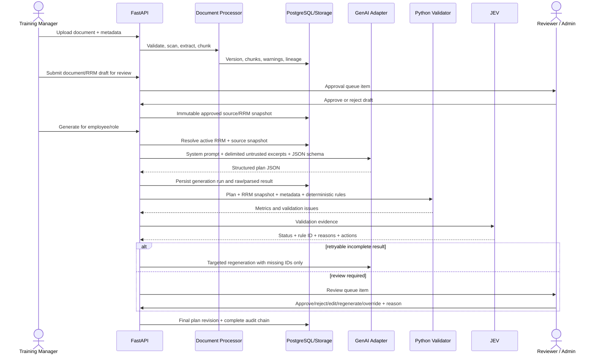
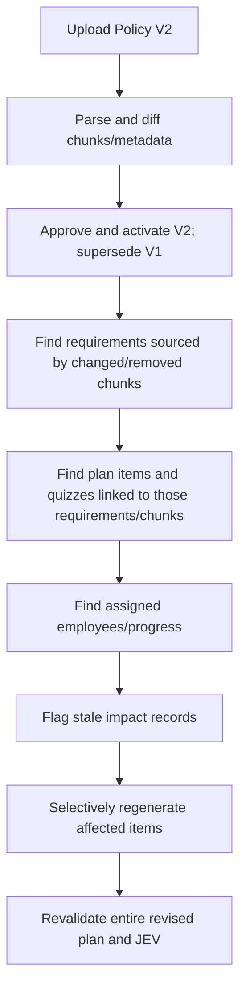

# SkillSprint AI - Phase 0 Architecture Blueprint

Status: **PLANNED - NOT IMPLEMENTED**  
Source of truth: `docs/SkillSprint AI-Generative AI PowerPlay_SRS.pdf` (SRS v1.0, 52 pages)  
Constraint: competition-ready build in approximately three days.

## 1. System context

SkillSprint AI converts approved organizational documents into role-specific onboarding plans, validates every structured result independently against an approved Role Requirement Matrix (RRM), routes uncertain results for human review, and tracks delivery and progress. Uploaded document text is untrusted data. GenAI generates; deterministic Python validates; JEV makes the final explainable workflow decision.



External boundaries are Supabase Auth/PostgreSQL/Storage and the configured GenAI provider. Live HRMS, payroll, enterprise IdP, and commercial LMS integration are explicitly outside mandatory scope.

## 2. Architectural principles

1. **Ground truth before generation:** only approved, active RRM requirements and approved document versions may ground mandatory content.
2. **Independent pipelines:** generation and validation share immutable inputs/identifiers, never approval logic. The validator never asks an LLM to judge output.
3. **Structured contracts:** provider output is JSON validated before persistence; prose parsing is never the control plane.
4. **Traceability by construction:** requirement, document-version, chunk/location, prompt, model, generation, validation, and decision IDs survive end to end.
5. **Configuration over code:** roles, stages, requirement types, precedence, thresholds, quiz types, and provider selection are data/config driven.
6. **Immutable evidence:** versions and run snapshots are append-only; supersession creates new versions.
7. **Least privilege:** browser uses the Supabase anon key; the service-role key is backend-only. Database RLS complements API authorization.
8. **Human authority is explicit:** override never erases machine evidence and requires actor, reason, before/after state, and timestamp.
9. **Fail closed:** unknown source IDs, stale versions, ambiguous precedence, malformed JSON, or missing mandatory evidence cannot become VERIFIED.
10. **Time-boxed delivery:** implement vertical slices around the evaluator journey before breadth features.

## 3. End-to-end data flow



Every run captures employee/role context, RRM revision, source document-version IDs, chunk IDs and hashes, prompt version, model/configuration, schema version, timestamps, and parent run/revision.

## 4. Frontend architecture

Planned stack: Next.js, TypeScript, Tailwind CSS, shadcn/ui.

- Route groups by persona: authentication; admin/training documents, roles, RRM, generation, reports; reviewer queue; manager team view; employee learning view.
- Server-side data access through a typed API client; no privileged Supabase key in the browser.
- Feature folders mirror backend domains. Shared components handle evidence drawers, status badges, source citations, filters, diff views, tables, and accessible forms.
- Long operations return `202 Accepted` plus run ID. UI polls bounded status endpoints initially; server-sent events are optional after the core path works.
- Every JEV status links to its metrics, issue codes, rule version, and source evidence. Review edits are new plan revisions, never silent in-place mutation.
- Responsive, keyboard-accessible layouts with loading, empty, error, stale-data, and permission-denied states.

## 5. Backend architecture

Planned stack: Python 3.12, FastAPI, Pydantic.

```text
apps/web/                 # Phase 1+, Next.js
services/api/             # FastAPI routes, auth dependencies, orchestration
packages/domain/          # entities, enums, pure business rules
packages/document_processing/
packages/retrieval/
packages/genai/           # provider interface, prompts, schemas
packages/validation/      # deterministic validators only
packages/jev/             # ordered decision table only
packages/security/
schemas/                  # versioned JSON schemas
prompts/                  # versioned prompt templates
config/                   # stages, precedence, validation thresholds
sample_data/              # fictional company pack and expected metadata
tests/                    # unit, integration, contract, adversarial, E2E
docs/                     # SRS and design documentation
```

This is the intended structure; Phase 0 does not scaffold application packages. Backend modules expose repository interfaces so orchestration is testable without Supabase or Gemini. Route handlers remain thin. Domain services own transactions and state transitions. Jobs use a database-backed run table and worker lease; an external queue is deferred unless load proves it necessary.

## 6. Document-processing pipeline

1. Authenticate and authorize uploader.
2. Stream to quarantine; enforce allowlisted `.pdf`/`.docx`, signature/MIME match, configurable size/page limits, safe filename, and hash-based duplicate detection.
3. Enforce the configurable initial application limit of **15 MB per file**. Stream to quarantine and reject oversize input before parsing.
4. Malware scanning is a deployment control; failed/unavailable scans quarantine rather than approve.
5. Record metadata: stable document ID, category, department, version label, effective/expiry dates, creator, SHA-256, and supersession link.
6. Parse PDF page-by-page and DOCX paragraph/table-by-table. Preserve page, heading, paragraph, section path, and character offsets where available.
7. Normalize whitespace without changing meaning. OCR is **out of MVP**: scanned or otherwise unextractable PDFs become `NEEDS_REVIEW` and cannot become active ground truth.
8. Split by headings/paragraphs, then token-aware windows with small overlap. Never cross an explicit section boundary silently.
9. Store immutable chunks with text hash and parser version. Run suspicious-pattern detection and label evidence; do not execute or promote embedded instructions.
10. Extract candidate requirements for human confirmation. A requirement is not validation ground truth until approved in an RRM revision.
11. A Training Manager may create/edit and submit a document version or RRM draft. A Reviewer or Admin approves/rejects it. Training Managers cannot normally approve their own drafts.
12. Mark a document version active only after approval. Superseded versions remain queryable.

Parser adapters make unseen PDF/DOCX inputs code-independent. Extraction confidence and warnings route poor-quality or ambiguous content to review.

## 7. Retrieval strategy

Retrieval is constrained before ranking by active approved document versions, selected role/department, applicable requirement IDs, effective date, and access policy. Candidate chunks come from approved RRM-to-source relationships first. PostgreSQL lexical/full-text retrieval may expand or rank supporting context where useful. Embeddings are **not required for MVP** and may be added post-competition only if measured retrieval tests demonstrate a need. The generator receives a bounded evidence pack with opaque IDs and delimited text and may cite only provided IDs.

Retrieval logs query filters, candidates, final chunks, scores, and truncation. Absence of sufficient evidence produces an insufficient-information result, not model improvisation. Supabase `pgvector` is optional and does not replace relational source links.

## 8. Role Requirement Matrix design

The RRM is an approved, versioned snapshot mapping a role to requirements. Requirements carry type (`MUST_KNOW`, `MUST_COMPLETE`, `MUST_DEMONSTRATE`, `MUST_ACKNOWLEDGE`, `RECOMMENDED`, `OPTIONAL`, `NOT_APPLICABLE`), mandatory flag, competency, priority, due stage, assessment requirement, applicability expression, and authoritative source citations. `role_requirements` adds role/department/location/experience applicability, exception/condition data, sequencing, and approval state.

Approval freezes a matrix revision and its source set. A Training Manager may author and submit the draft; a Reviewer or Admin must approve or reject it. The creator and approver are recorded, and self-approval by a Training Manager is prohibited. New roles require data entry and approval, not code. Conflicting or ambiguous candidates cannot be silently approved. Only approved/current-effective sources can become active ground truth. An explicit approved role-specific exception outranks a general policy where applicable; unresolved conflicts route to `MANUAL_REVIEW`. Precedence remains data/config driven.

## 9. GenAI pipeline and structured output

`AIProvider.generate(request, schema, config) -> ProviderResult` isolates Gemini. Provider-specific SDK objects do not enter the domain layer. The orchestrator builds a request from a frozen RRM/source snapshot, versioned prompt, and employee context; validates the response against the versioned Pydantic/JSON schema; rejects unknown citations; persists raw response securely plus normalized plan; and invokes validation.

Generation uses low/controlled randomness, bounded output, provider timeouts, correlation IDs, and no secrets or unnecessary employee data in prompts. Invalid JSON may receive one provider-format repair retry and one targeted regeneration; repair output is still untrusted. Targeted regeneration is restricted to issue/requirement IDs and produces a new revision linked to its parent.

The contract is defined in `GENAI_CONTRACT.md`. No regex/prose extraction is used for business fields.

## 10. Independent validation architecture

The validation package has no provider dependency or network access. Its explicit input is `{plan_revision, schema_version, approved_rrm_snapshot, approved_source_snapshot, deterministic_rule_config}`. Validators are pure where possible and emit normalized `ValidationIssue` records containing validator/rule version, entity path, expected/actual values, evidence IDs, severity, and recommended action. An aggregator computes coverage, traceability, consistency, and counts without accepting model-supplied scores.

Semantic similarity may identify candidates for duplicate/support review, but cannot alone prove factual support or contradiction. Such uncertainty becomes `MANUAL_REVIEW`. See `VALIDATION_DESIGN.md`.

## 11. JEV architecture

JEV is an ordered, versioned decision table over persisted validation evidence. It never calls GenAI. It emits one of `VERIFIED`, `VERIFIED_WITH_WARNING`, `INCOMPLETE`, `UNSUPPORTED`, `CONTRADICTORY`, `MANUAL_REVIEW`, plus matched rule ID, reasons, evidence IDs, and next action. Precedence and retry limits are explicit in `JEV_DESIGN.md`.

## 12. Human review

Review queue items are created from document/RRM submissions, JEV decisions, and policy-impact flags. Reviewers see the generated item, expected requirement, citations, source excerpt/version, validator findings, creator, and history. Training Managers create/edit document and RRM drafts and submit them; Reviewers or Admins approve/reject those drafts. Training Managers cannot normally approve their own drafts. An Admin emergency override requires a non-empty reason, records creator and approver, and creates an audit event. For generated content, actions remain approve, reject, edit, regenerate, comment, or override. Edit creates a new revision and re-runs all deterministic validation. Override changes workflow disposition, not historical JEV evidence.

## 13. Policy version and impact handling



Impact edges are relational, not inferred from prose at update time. Chunk fingerprints classify unchanged, changed, added, and removed content. A new approved RRM revision records requirement changes. Completed employee work is preserved; affected content is marked outdated and reassignment behavior is policy-driven. Full-plan regeneration is a fallback only when lineage is insufficient.

## 14. Prompt-injection defense

- System/developer instructions and schema live outside retrieved content; documents are clearly delimited and labeled untrusted.
- The model is told never to follow document instructions, reveal secrets, change roles, or self-approve.
- Static detectors flag instruction-like phrases, encoded/hidden text, external-action requests, credential requests, and role/system impersonation. Detection creates audit/review flags; it is not claimed to be perfect.
- Retrieval strips active content and never executes macros, links, scripts, or embedded objects. DOCX relationships and PDF actions are not followed.
- Output is allowlisted by schema; citations must resolve to the frozen source set. Tool use is disabled for document content.
- Adversarial fixtures include fake administrator text, indirect injection, conflicting hidden text, and irrelevant instructions.

## 15. Security boundaries

- Supabase Auth issues identities; FastAPI verifies JWT issuer/audience/signature and maps application roles. RLS provides defense in depth.
- The MVP serves one fictional organization. RBAC and RLS enforce persona and record-level access within that organization; there is no MVP tenant discriminator.
- Storage separates quarantine, approved sources, and exports with private buckets and short-lived signed URLs.
- Service-role and Gemini keys remain server-side environment secrets. Logs redact tokens, keys, document bodies, and sensitive employee fields.
- The configurable upload limit starts at 15 MB per file. MIME/signature validation, decompression limits, malware scan hooks, rate limits, CSRF strategy, secure headers, CORS allowlist, and dependency scanning are required.
- Minimize employee PII; define retention/deletion policy before production. Audit access to source documents and exports.

## 16. Auditability

Append-only audit events capture actor/service, action, target, request/correlation ID, before/after hashes or safe diffs, reason, IP/user-agent where appropriate, and time. Generation evidence includes provider/model, prompt/schema versions, parameters, source/RRM snapshots, retries, latency, and token/cost metadata. Validation and JEV records are versioned and immutable. Database triggers may protect critical state transitions, but domain services remain the primary writer.

## 17. Errors, retries, and idempotency

- RFC 9457-style problem responses with stable codes; never expose secrets/provider bodies.
- Upload/generation endpoints accept idempotency keys. Unique constraints prevent duplicate active runs.
- Retry only transient provider/network errors with exponential backoff and jitter (maximum three attempts including initial call). Do not retry auth, quota exhaustion without delay, invalid source, or deterministic schema failure indefinitely.
- Jobs use leases, heartbeat, attempt count, terminal state, and dead-letter/manual recovery. Partial artifacts remain non-active.
- Each stage is restartable from persisted immutable inputs. A circuit breaker protects provider outages; the UI shows actionable state.

## 18. Hidden-evaluation adaptability

Parser/provider/validator interfaces, versioned schemas, configurable precedence, data-driven roles/RRM/stages, and issue-code-to-JEV rules allow unseen PDF/DOCX, new roles, new quiz types, revised/outdated policies, exceptions, ambiguous/conflicting clauses, injections, and unsupported topics without core-code changes. A fixture runner imports evaluator packs into isolated test datasets and reports deterministic evidence.

## 19. Deployment architecture

Planned deployment shape: Next.js web service, FastAPI API plus worker process, managed Supabase Auth/PostgreSQL/Storage, and Gemini. The deployment provider remains open until a later phase. Environments are local/test/production with separate projects and secrets. HTTPS, health/readiness endpoints, structured logs, database backups, migration discipline (Phase 1+), and error/latency monitoring are required. Region selection should minimize API/database latency. The SRS target is 99% availability during evaluation excluding GenAI outages and under 30 seconds for a standard generate-and-validate flow; asynchronous runs and timing telemetry are necessary.

## 20. Major risks and mitigations

| Risk | Impact | Mitigation |
|---|---|---|
| Three-day implementation window | Critical | Build one end-to-end evaluator path; defer polish/export breadth |
| SRS breadth (66 FRs + deliverables) | Critical | MUST-first prioritization in `SRS_MATRIX.md` and `PHASE_PLAN.md` |
| Deterministic contradiction/support limits | High | Exact rule checks plus conservative human-review routing |
| Dataset not yet present | Critical | Create minimum 20-doc/10-role/150-requirement pack early |
| PDF/DOCX extraction variability | High | Golden fixtures, quality metrics, page/paragraph lineage, manual fallback |
| GenAI latency/quota/invalid JSON | High | bounded evidence, schema mode, timeout/retry/circuit breaker |
| RLS/RBAC mistakes | High | deny-by-default policies and role-matrix security tests |
| Prompt injection | High | strict data separation, no tools, detectors, adversarial tests |
| Selective regeneration lineage gaps | High | immutable source-to-requirement-to-item dependency edges |
| Competition requires five days of commits while current brief says ~3 days | High | Organizer/team must reconcile; architecture cannot solve schedule conflict |

## 21. Architecture audit conclusion

No explicit SRS functional area is intentionally omitted from the planned architecture. Accepted MVP decisions are: one fictional organization; approval separation; 15 MB configurable upload limit; no OCR; RRM/source-first plus PostgreSQL lexical retrieval; no required embeddings; configurable stage data with Day 1, Week 1, Week 2, Day 30, Day 60, and Day 90 as examples; CSV/JSON-first exports; and data-driven precedence with approved role-specific exceptions. Remaining decisions are listed in `PHASE_PLAN.md`. Multi-tenancy is a post-competition extension only and is not represented in the MVP schema. The SRS’s detailed labels are validation issue codes; the approved six statuses are the only JEV outcomes.
