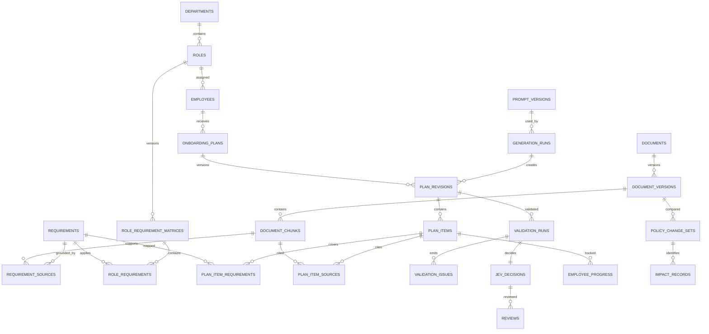

# PostgreSQL / Supabase Database Design

Status: **PLANNED - no migrations created**. The competition MVP supports one fictional organization. UUID primary keys, `timestamptz` UTC timestamps, snake_case names, explicit foreign keys, and `created_at`/`updated_at` apply unless noted. No `organizations` table or `organization_id` discriminator is required for MVP. Soft archival is preferred to deleting auditable records.

## Enums

Planned enums include `app_role` (ADMIN, TRAINING_MANAGER, REVIEWER, MANAGER, EMPLOYEE), `record_status`, `document_status` (QUARANTINED, PROCESSING, NEEDS_REVIEW, APPROVED, REJECTED, SUPERSEDED), `requirement_type`, `priority`, `experience_level`, `generation_status`, `validation_severity` (INFO, WARNING, ERROR, CRITICAL), `jev_status` (six approved statuses), `review_action`, and `progress_status`. Enums that evaluators may extend quickly (stage, quiz type, precedence class) should be lookup/config tables instead of PostgreSQL enums.

## Identity and organizational structure

| Table | Purpose and important columns | Keys / constraints / indexes |
|---|---|---|
| `profiles` | Application identity linked to Supabase Auth; `auth_user_id`, `display_name`, `status`, `last_login_at` | PK `id`; UQ `auth_user_id`; index role/status via membership |
| `profile_roles` | Many-role RBAC assignment; `profile_id`, `role` | composite PK; FK profile; index `role` |
| `departments` | Department hierarchy; `code`, `name`, `parent_id`, `status` | PK; self FK; UQ `code`; index parent/status |
| `roles` | Data-driven job role; `code`, `name`, `description`, `department_id`, `status` | PK; FK department; UQ `code`; index department/status |
| `employees` | Minimal learner profile; `employee_code`, `profile_id?`, `role_id`, `department_id`, `experience_level`, `location_code`, `joining_date`, `manager_employee_id`, `required_competencies jsonb`, `previous_experience_summary`, `training_status` | PK; FKs; UQ `employee_code` and optional profile; indexes role, department, manager, status |
| `onboarding_stage_definitions` | Configurable stage data; `code`, `label`, `sequence`, `start_day`, `end_day`, `active` | PK; UQ `code`; UQ active `sequence`; default seed examples may be Day 1, Week 1, Week 2, Day 30, Day 60, Day 90; validators use IDs/order, never fixed labels |

## Documents and ground truth

| Table | Purpose and important columns | Keys / constraints / indexes |
|---|---|---|
| `documents` | Stable logical document; `document_code`, `title`, `category`, `department_id`, `precedence_class`, `status` | PK; FKs; UQ `document_code`; indexes category/department/status |
| `document_versions` | Immutable uploaded version; `document_id`, `version_label`, `storage_path`, `sha256`, `mime_type`, `size_bytes`, `effective_at`, `expires_at`, `status`, `supersedes_version_id`, `parser_version`, `extraction_quality`, `created_by`, `submitted_by/at`, `approved_by/at`, `rejected_by/at`, `decision_reason`, `admin_override` | PK; FKs to profiles; UQ `(document_id, version_label)` and `sha256` according to duplicate policy; partial UQ one APPROVED current-effective version/document; checks: approver is Reviewer/Admin, TM creator cannot self-approve, Admin override requires reason; indexes effective/status/hash |
| `document_chunks` | Traceable extracted unit; `document_version_id`, `chunk_key`, `text`, `text_hash`, `section_path`, `heading`, `page_number`, `paragraph_start/end`, `char_start/end`, `token_count`, `suspicious`, `metadata jsonb` | PK; FK version; UQ `(document_version_id, chunk_key)`; indexes version/location/hash and PostgreSQL GIN full-text search. No MVP embedding column/vector index. |
| `document_security_findings` | Injection/malware/extraction warnings; `version_id`, `chunk_id?`, `detector`, `rule_code`, `severity`, `evidence`, `status` | PK; FKs; indexes version/status/severity |
| `requirements` | Versioned canonical requirement statement; `requirement_code`, `revision`, `type`, `statement`, `competency`, `mandatory`, `priority`, `due_stage_id`, `assessment_required`, `applicability jsonb`, `status`, `supersedes_requirement_id` | PK; self/stage FKs; UQ `(requirement_code, revision)`; indexes status/type/mandatory |
| `requirement_sources` | Provenance and authority; `requirement_id`, `document_version_id`, `chunk_id`, `support_type`, `precedence_rank`, `is_primary` | PK; FKs; UQ requirement/chunk/support; indexes source reverse lookup |
| `role_requirement_matrices` | RRM header/revision; `role_id`, `revision`, `status`, `created_by`, `submitted_by/at`, `approved_by/at`, `rejected_by/at`, `decision_reason`, `admin_override`, `source_snapshot_hash` | PK; profile/role FKs; UQ `(role_id, revision)`; partial UQ one APPROVED active revision/role; checks: approver is Reviewer/Admin, TM creator cannot self-approve, Admin override requires reason; indexes status |
| `role_requirements` | Role-to-requirement ground truth; `matrix_id`, `requirement_id`, `mandatory_override?`, `priority_override?`, `due_stage_id`, `condition jsonb`, `is_approved_role_exception`, `exception_text`, `sequence`, `prerequisite_role_requirement_id?` | PK; FKs; UQ `(matrix_id, requirement_id, condition_hash)`; indexes matrix/requirement/sequence |
| `policy_precedence_rules` | Configurable authority hierarchy; `scope`, `higher_class`, `lower_class`, `priority`, `effective_at`, `active`; active ground truth must be approved/current-effective, explicit approved role exceptions outrank applicable general policy, unresolved conflicts are not resolved by this table | PK; check higher != lower; UQ scope/pair/effective; indexes active/priority |

## Generation, plans, validation, and review

| Table | Purpose and important columns | Keys / constraints / indexes |
|---|---|---|
| `prompt_versions` | Immutable prompts; `name`, `semantic_version`, `template`, `schema_version`, `sha256`, `status`, `created_by`, `approved_by/at` | PK; UQ `(name, semantic_version)` and hash; indexes name/status |
| `generation_runs` | Provider request lifecycle; `employee_id`, `role_id`, `matrix_id`, `prompt_version_id`, `provider`, `model`, `config jsonb`, `source_snapshot jsonb`, `status`, `attempt`, `parent_run_id`, `idempotency_key`, `raw_response_path/hash`, `error_code`, tokens/latency, started/completed timestamps | PK; FKs; UQ `idempotency_key`; indexes status/time/employee/parent |
| `onboarding_plans` | Stable plan identity; `employee_id`, `role_id`, `status`, `current_revision_id?` | PK; FKs; partial UQ active plan per employee/purpose; indexes employee/status |
| `plan_revisions` | Immutable plan JSON revision; `plan_id`, `revision`, `generation_run_id`, `schema_version`, `rrm_revision_id`, `content jsonb`, `content_hash`, `supersedes_revision_id`, `status` | PK; FKs; UQ `(plan_id, revision)`; indexes generation/RRM/status |
| `plan_items` | Queryable normalized stage/module/child nodes; `plan_revision_id`, `parent_item_id?`, `stage_id`, `item_type`, `external_item_id`, `sequence`, `title`, `content jsonb`, `mandatory`, `status` | PK; self/revision/stage FKs; UQ `(plan_revision_id, external_item_id)`; indexes type/stage/status |
| `plan_item_requirements` | Item coverage edges; `plan_item_id`, `requirement_id` | composite PK; reverse index requirement |
| `plan_item_sources` | Item citation edges; `plan_item_id`, `document_version_id`, `chunk_id`, `locator` | PK; UQ item/chunk; reverse indexes version/chunk |
| `validation_runs` | Immutable validator execution; `plan_revision_id`, `rule_set_version`, `status`, metric numerators/denominators/scores, `input_hash`, started/completed timestamps | PK; FK; UQ `(plan_revision_id, rule_set_version, input_hash)`; indexes status/time |
| `validation_issues` | Explainable finding; `validation_run_id`, `validator`, `rule_code`, `severity`, `entity_path`, `expected jsonb`, `actual jsonb`, `evidence jsonb`, `requirement_id?`, `plan_item_id?`, `resolution_status` | PK; FKs; indexes run/severity/code/resolution |
| `jev_decisions` | Deterministic result; `validation_run_id`, `rule_set_version`, `matched_rule_id`, `status`, `reason_codes jsonb`, `reasons jsonb`, `evidence_issue_ids uuid[]`, `recommended_action`, `input_hash` | PK; FK; UQ validation run/input hash; indexes status/time |
| `reviews` | Human action ledger; `plan_revision_id`, `jev_decision_id`, `reviewer_profile_id`, `action`, `reason`, `comment`, `before_hash`, `after_revision_id?` | PK; FKs; index queue `(action, created_at)` and plan/time; append-only |

## Progress, impact, audit, and reports

| Table | Purpose and important columns | Keys / constraints / indexes |
|---|---|---|
| `employee_progress` | Per employee/plan item state; `employee_id`, `plan_id`, `plan_item_id`, `status`, `percent`, `score`, `attempts`, `due_at`, `completed_at`, `evidence jsonb` | PK; FKs; UQ employee/item; indexes employee/status/due, plan |
| `policy_change_sets` | Approved V1-to-V2 comparison; `old_version_id`, `new_version_id`, summary, diff hash/status | PK; FKs; UQ pair; indexes new/status |
| `impact_records` | Dependency-based affected object; `change_set_id`, `requirement_id?`, `plan_id?`, `plan_item_id?`, `employee_id?`, `impact_type`, `status`, `reason` | PK; FKs; deduplicating unique expression/index; indexes status/object IDs |
| `audit_logs` | Append-only security/business event; `actor_profile_id?`, `service_actor`, `action`, `target_type/id`, `correlation_id`, `reason`, `creator_profile_id?`, `approver_profile_id?`, `admin_override`, `before_hash`, `after_hash`, `metadata jsonb`, `ip_hash`, `occurred_at` | PK; FKs; indexes occurred time, actor/time, target, correlation; no `updated_at` |
| `job_runs` | Durable async orchestration; `job_type`, `subject_type/id`, `status`, `attempt`, `max_attempts`, `lease_owner/until`, `next_attempt_at`, `error_code` | PK; UQ idempotency key; indexes runnable jobs/status/time |

## ER diagram

## Integrity, RLS, and retention

- Deferrable constraints/triggers enforce immutable approved versions, rubric weights, one active document/RRM revision, approval separation, mandatory override reasons, and legal state transitions.
- RLS for the single organization: employees read their assigned plans/progress; managers read direct reports; reviewers read approval/review queues and evidence; Training Managers create/edit/submit document and RRM drafts but cannot approve them; Admins administer access and may approve/reject. Backend service-role bypass is limited to trusted services.
- PostgreSQL full-text indexes are the MVP search enhancement. Embeddings/vector indexes are post-competition options only if retrieval testing demonstrates need. JSONB is for flexible payload snapshots, never a substitute for critical relational edges.
- Retention rules for raw provider responses, rejected uploads, employee data, exports, and audit logs are an open decision; legal/privacy review is required before production.

## Post-competition extension

Multi-tenancy may later add an organization boundary and organization-scoped uniqueness/RLS. It is deliberately absent from the MVP schema and authorization design; the competition application must not carry unused tenant columns or abstractions.
